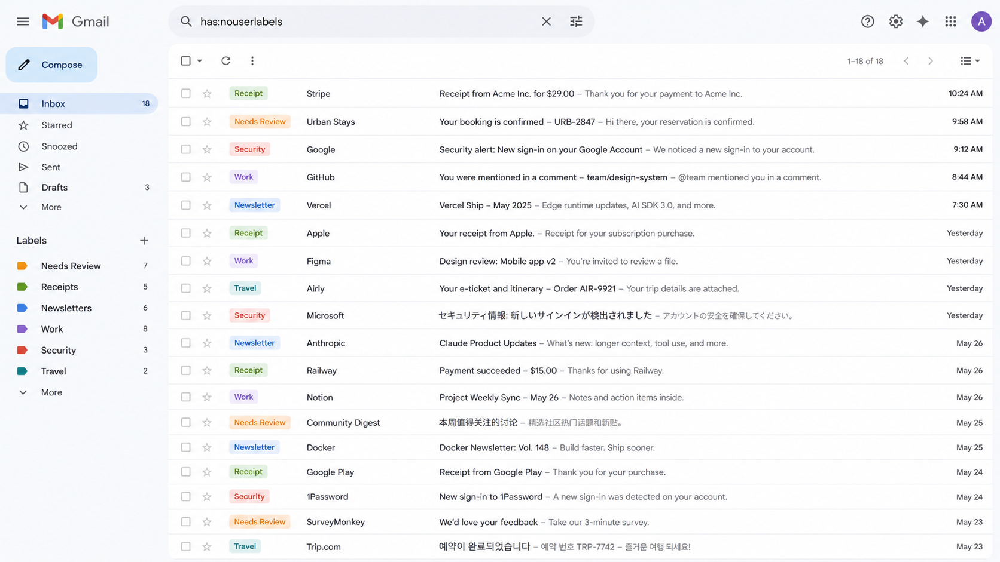

<div align="center">

# Gmail Autolabel

**Claude Desktop 向けの AI 自動 Gmail ラベリングツール。**
受信トレイを手作業で仕分けるのはもう終わり。Claude が読んで、分類して、ラベルを付けてくれます。

[](LICENSE)
[](https://www.python.org/)
[](https://modelcontextprotocol.io/)
[](https://claude.ai/download)

[English](./README.md) · [한국어](./README.ko.md) · [中文](./README.zh.md) · **日本語**

<br>



<sub><i>Claude が仕分けた受信トレイ: 領収書、セキュリティ通知、ニュースレター、出張、仕事まで —— すべて自動分類、多言語メールもそのまま処理できます。</i></sub>

</div>

---

## できること

`gmail-autolabel` は [Model Context Protocol](https://modelcontextprotocol.io/)
サーバーで、Claude Desktop に Gmail を自動分類・ラベリングさせるためのものです。

Claude を受信トレイに繋ぐと、こうなります:

1. **ユーザーラベルが付いていない**最新メールを取得 (`has:nouserlabels`)
2. まず件名と差出人を確認、判断に迷うときだけ本文を読み込む
3. 既存ラベルを適用、または必要に応じて新規ラベルを作成
4. それでも判断できない場合は **「Needs Review」** ラベルへ退避

ハードコードされたルールはありません。すべての分類判断はあなたのプロンプトに
基づいて Claude が行います。手動でも、スケジュール実行でも使えます。

## クイックデモ

Claude Desktop でこう話しかけます:

> ラベルなしのメールを整理して。曖昧なものは本文を読んで判断、
> それでも分からなければ「Needs Review」を付けて。

Claude はおおむね次のように実行します:

```
list_labels()                            # 既存カテゴリーを確認
list_unlabeled_emails(50)                # 仕分け対象 50 件
get_email_content(<id>)                  # 曖昧なものだけ
add_label_to_email(<id>, "領収書")       # ラベルを適用
create_label("ニュースレター")            # 新規作成も
```

## 公式 Gmail MCP との違い

|              | 公式 Gmail MCP (claude.ai)   | gmail-autolabel               |
| ------------ | ---------------------------- | ----------------------------- |
| ホスティング | Anthropic ホスト             | **ローカル実行**              |
| OAuth スコープ | 読み取り / 送信 / 変更 すべて | `gmail.modify` のみ          |
| 送信 / 削除  | 可能                         | **不可**                      |
| データ経路   | Anthropic 経由               | 直接: 自分の PC ↔ Google      |
| カスタマイズ | 固定のツールセット           | コードを完全に所有            |
| 重点         | 一般的な Gmail 利用          | ラベル仕分けワークフロー特化  |

ローカルで動く、最小権限、透明性のある受信トレイ整理ツールが欲しいなら、
これがぴったりです。

## 提供ツール

| ツール                                        | 説明                                              |
| --------------------------------------------- | ------------------------------------------------- |
| `list_unlabeled_emails(max_results=50)`       | ユーザーラベルなしの最新メール (`has:nouserlabels`) |
| `get_email_content(email_id, max_chars=10000)` | 本文全文 (HTML 除去、長さ制限)                  |
| `get_email_labels(email_id)`                  | 特定メールのラベル                                |
| `list_labels(user_only=True)`                 | メールボックスの全ラベル                          |
| `add_label_to_email(email_id, label_name)`    | 名前指定でラベル適用 (事前に存在が必要)           |
| `create_label(name)`                          | ラベル作成 (冪等)                                 |

## 前提条件

- macOS または Linux
- Python 3.10+
- [`uv`](https://github.com/astral-sh/uv) — `brew install uv`

---

## インストール手順

### 1. Google Cloud プロジェクトの作成

1. <https://console.cloud.google.com/> にアクセスし、Gmail アカウントでログイン
2. 上部のプロジェクト選択ドロップダウン → **新しいプロジェクト**
3. 名前は任意 (例: `gmail-autolabel`) → **作成**
4. 作成後、そのプロジェクトが選択されていることを確認

### 2. Gmail API の有効化

1. サイドバー → **API とサービス → ライブラリ**
2. `Gmail API` を検索 → クリック → **有効にする**

### 3. OAuth 同意画面の設定 ⚠️ 一番つまづくところ

1. サイドバー → **API とサービス → OAuth 同意画面**
2. **User Type**: **External** を選択 (Internal は Workspace 組織専用)
3. アプリ名 (`Gmail Autolabel`)、サポート用メール、開発者連絡先メールを入力。
   その他の任意項目は空欄で OK
4. **保存して次へ**
5. **スコープ(Scopes)**: そのまま **保存して次へ** —— OAuth クライアントが
   実行時に要求するので、ここで追加する必要はありません
6. **テストユーザー(Test users)**: **+ ADD USERS** をクリックし、
   **自分の Gmail アドレス**を追加
   ⚠️ これを忘れると認証時に `403 access_denied` が出ます
7. **保存して次へ** → 完了。アプリは **Testing** 状態のままにします (§5 参照)

### 4. Desktop OAuth クライアントの発行

1. サイドバー → **API とサービス → 認証情報**
2. **+ 認証情報を作成 → OAuth クライアント ID**
3. **アプリケーションの種類: Desktop app** ← 重要。Web app ではありません
4. 名前 `gmail-autolabel-desktop` (任意)
5. **作成** → JSON をダウンロード
6. ファイルを移動してリネーム:

   ```bash
   mkdir -p ~/.config/gmail-autolabel
   mv ~/Downloads/client_secret_*.json ~/.config/gmail-autolabel/credentials.json
   ```

   別のパスを使うときは `GMAIL_AUTOLABEL_CREDENTIALS=/path/to/credentials.json` を設定

### 5. ⚠️ 7 日間の有効期限の罠

**Testing** 状態のアプリが発行する refresh token は **7 日後に失効**します。
これは Google の仕様で、バグではありません。

| 選択肢                                | 利点                  | 欠点                                                              |
| ------------------------------------- | --------------------- | ----------------------------------------------------------------- |
| **A. Testing 維持 + 毎週再認証**      | 無料、すぐ使える      | 毎週コマンド 1 行                                                 |
| **B. Production に公開**              | トークン無期限        | `gmail.modify` は制限スコープ → Google 審査が必要                |
| **C. Workspace + Internal タイプ**    | 審査不要、無期限      | 有料の Google Workspace が必要                                    |

**推奨: A。** トークンが切れたらコマンド 1 行で復旧 (§再認証 を参照)。

### 6. 初回 OAuth 認証

```bash
uvx --from git+https://github.com/dr-coton/gmail-autolabel gmail-autolabel auth
```

流れ:

1. ローカルに一時 HTTP サーバー起動 (ランダムポート)
2. ブラウザが自動で開いて Google ログイン画面へ
3. 自分の Gmail アカウントを選択
4. **「このアプリは確認されていません」** 警告が出ます —— 正常です。
   **詳細(Advanced)** → **Gmail Autolabel(安全ではないページ)に移動** をクリック
5. 権限を許可 → localhost にリダイレクト
6. ターミナルに `Authentication complete. Token saved to ...` が出力される

トークン保存先: `~/.config/gmail-autolabel/token.json`

### 7. Claude Desktop の設定

設定ファイルを開きます:

```bash
open -e ~/Library/Application\ Support/Claude/claude_desktop_config.json
```

`mcpServers` を追加 (既存設定にマージ):

```json
{
  "mcpServers": {
    "gmail-autolabel": {
      "command": "uvx",
      "args": [
        "--from",
        "git+https://github.com/dr-coton/gmail-autolabel",
        "gmail-autolabel"
      ]
    }
  }
}
```

保存 → **Claude Desktop を完全終了 (⌘Q) して再起動**

### 8. 動作確認

Claude Desktop で新規チャットを開き、ツールアイコンをクリック →
`gmail-autolabel` と 6 つのツールが表示されれば成功:

> 私の Gmail のラベル一覧を見せて

`list_labels` の結果が返ってくれば完了です。

---

## 再認証

トークン期限切れ (Testing モードで 7 日ごと) のときはコマンド 1 行で復旧:

```bash
uvx --from git+https://github.com/dr-coton/gmail-autolabel gmail-autolabel auth --force
```

`--force` (エイリアス `--refresh`) が行うこと:

- 既存の `token.json` を削除
- Google に `prompt=consent` を送って新しい refresh token を強制発行

`--force` なしだと、Google が以前の同意をキャッシュして access token しか
返さない場合があり、また 1 週間後に同じ問題が起きます。復旧時は
`--force` の使用を推奨。

## アップデート

`uvx` は git URL をキャッシュします。新しいバージョンを取得するには:

```bash
uvx --refresh --from git+https://github.com/dr-coton/gmail-autolabel gmail-autolabel --help
```

キャッシュ更新と再認証を同時に:

```bash
uvx --refresh --from git+https://github.com/dr-coton/gmail-autolabel gmail-autolabel auth --force
```

## 権限スコープ

要求するのは `https://www.googleapis.com/auth/gmail.modify` のみ —— メール読み取りと
ラベル変更。送信、削除、アカウント設定の変更は **できません**。

権限の取り消しはいつでも可能: <https://myaccount.google.com/permissions>

## トラブルシューティング

| エラー                                            | 原因 / 解決                                                          |
| ------------------------------------------------- | -------------------------------------------------------------------- |
| `403 access_denied` (ブラウザ)                    | Test users にメール未追加 → §3 ステップ 6                            |
| `redirect_uri_mismatch`                           | OAuth client を Web app で作成 → **Desktop app** で再作成            |
| `invalid_grant: Token has been expired or revoked` | 7 日期限切れ → `gmail-autolabel auth --force` を実行              |
| `Token not found` (MCP 起動時)                    | 認証未完了 → §6 をやり直し                                           |
| Claude Desktop にツールが出ない                   | 設定 JSON の構文エラー、または完全再起動していない                   |
| `uvx: command not found`                          | `brew install uv`                                                    |
| MCP ログ確認                                      | `~/Library/Logs/Claude/mcp*.log`                                     |

## ローカル開発

```bash
git clone https://github.com/dr-coton/gmail-autolabel
cd gmail-autolabel
uv sync
uv run gmail-autolabel auth
```

ローカルチェックアウト用の Claude Desktop 設定:

```json
{
  "mcpServers": {
    "gmail-autolabel": {
      "command": "uv",
      "args": [
        "--directory",
        "/path/to/gmail-autolabel",
        "run",
        "gmail-autolabel"
      ]
    }
  }
}
```

## ロードマップ

- [ ] 1 回の実行で 50 件超のバッチラベリング
- [ ] システムプロンプトとして配布するラベル提案ルールのカスタマイズ
- [ ] ヘッドレス再認証 (cron 対応)
- [ ] 配信停止 / アーカイブの賢い提案
- [ ] 他の MCP クライアントへの対応 (Cursor など)

## コントリビュート

PR 歓迎します。大きな変更は先に issue で議論をお願いします。

## ライセンス

[MIT](LICENSE) © 2026 dr-coton
